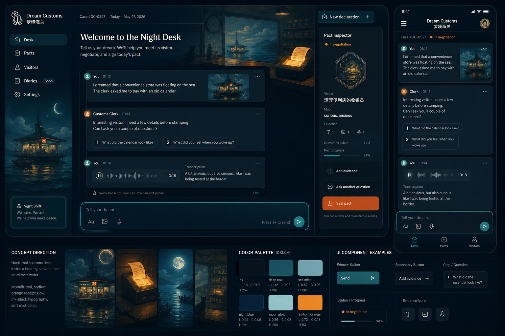

# Dream Customs UI/UX V2 Brief

Last updated: 2026-06-05

## 1. Feature Summary

Redesign Dream Customs from a one-shot Gradio form into a dream customs workbench. The user should be able to declare a dream through text, image, or voice, receive customs questions, add more evidence, continue negotiation, revise the pact draft, or seal the final pact.

The target user is tired, on mobile, and still carrying dream residue. The interface must feel vivid and strange, but the controls must be as obvious as a serious product tool.

## 2. Primary User Action

The primary action is not "submit once." It is "decide the next customs move": add material, answer, ask another question, revise the pact, or seal today's pact.

## 3. Design Direction

Color strategy: committed product UI. The app uses a dark nocturnal base with cobalt as the main action color, aurora cyan for evidence status, and coral as rare stamp ink.

Scene sentence: a half-awake user opens the app from bed under dim morning light, facing a night customs desk that turns dream fragments into a small action for today.

Anchor references:

- Codex app input composer: bottom-first multimodal input and clear action clustering.
- Linear / Raycast product discipline: dense but calm panels, obvious focus states, no decorative controls.
- Night train ticket window / customs stamp desk: the physical metaphor for evidence, permit, and final seal.

Visual probes generated for this direction:

Chosen lane: `Night desk probe` for layout and interaction, with `Night border probe` for pact stamp atmosphere. `Morning console probe` stays as a later light-mode reference.

## 4. Scope

Fidelity: production-ready Gradio app redesign.

Breadth: one main app surface plus all states needed for the flow.

Interactivity: shipped-quality multi-step Gradio behavior with session state.

Time intent: polish until it is good enough for a hackathon demo video and Space public use.

## 5. Layout Strategy

Use an app shell instead of a document page.

- Top: compact identity, current phase, model status, and safety note entry point.
- Center: conversation timeline with user declarations, evidence extraction, customs questions, and pact draft events.
- Bottom: Codex-style composer with text area, image attach, voice record/upload, mood chip, backend/model menu, and primary send button.
- Side on desktop, collapsible below timeline on mobile: pact inspector with visitor, permit ID, evidence count, risk, suggestion, weird task, and seal state.
- Output card: only becomes the dominant object after the user chooses to seal.

## 6. Key States

- Empty: show a compact dream evidence tray and one sentence telling the user they can start with any fragment.
- Declaring: composer has text, image, audio, and mood chips, with visible send state.
- Extracting: evidence chips show queued, extracting, extracted, or failed.
- Negotiating: customs questions appear one at a time or as a small set; user can answer, skip, or add evidence.
- Draft pact: inspector shows editable draft actions: revise suggestion, make it stranger, make it gentler, ask another question.
- Sealed pact: final card locks visually, provides copy text and screenshot-friendly layout.
- Error: inline recovery, not modal. Keep text-only path available.
- Safety escalation: supportive note appears above final action and avoids playful framing for severe distress.
- Reduced motion: no animated gates or delayed reveal. State changes crossfade or swap instantly.

## 7. Interaction Model

Core loop:

1. User adds dream evidence through composer.
2. App builds or updates `DreamIntake`.
3. System asks customs questions.
4. User chooses: answer, add material, skip, continue negotiation, or draft pact.
5. Draft pact appears in inspector.
6. User chooses: revise, add evidence, ask more, or seal.
7. Sealed pact renders final card.

Longer task behavior should come from real user agency, not artificial delay. Each extra round should incorporate the user's new material or choice into the next prompt.

## 8. Content Requirements

Primary labels:

- `Declare dream`
- `Attach image`
- `Record voice`
- `Send to customs`
- `Add material`
- `Ask another question`
- `Draft pact`
- `Revise pact`
- `Seal today's pact`
- `Start a new declaration`

Output fields remain:

- Dream visitor
- Permit ID
- Contraband
- Risk level
- Alliance reading
- Practical suggestion
- Weird task
- Bedtime release
- Safety note

Image roles:

- Atmospheric header or empty-state art: generated raster image.
- Evidence thumbnails: user upload.
- Seal and permit marks: CSS/HTML, not sketchy SVG.

## 9. Recommended Impeccable References

- `layout.md`: rebuild the app shell, composer, timeline, and inspector.
- `colorize.md`: apply the nocturnal palette without losing contrast.
- `harden.md`: error, empty, loading, safety, i18n, and mobile states.
- `animate.md`: restrained state motion and reduced-motion fallback.
- `polish.md`: final pass after implementation.

## 10. Open Questions

Defaults chosen for implementation:

- Default visual lane: Night Desk.
- Default backend route: keep `demo` for deterministic fallback, add hosted MiniCPM route as optional `model`.
- Default voice behavior: transcript first, no voice output.
- Default deployment: Hugging Face Space remains the public demo, Modal can host heavier model experiments if Space hardware is insufficient.
